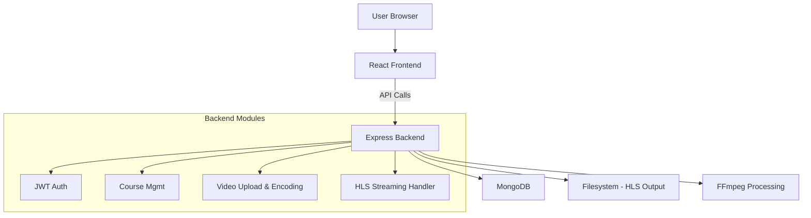
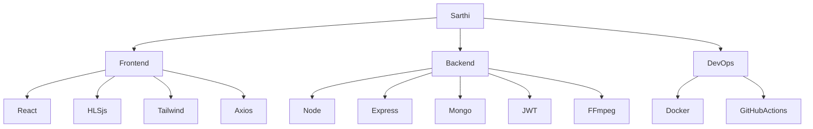
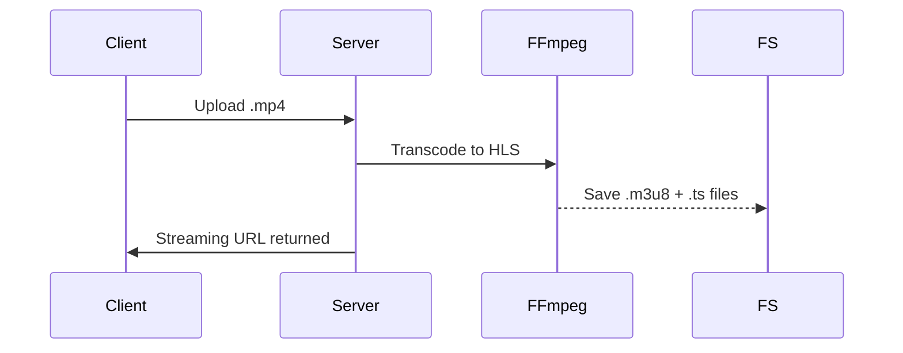
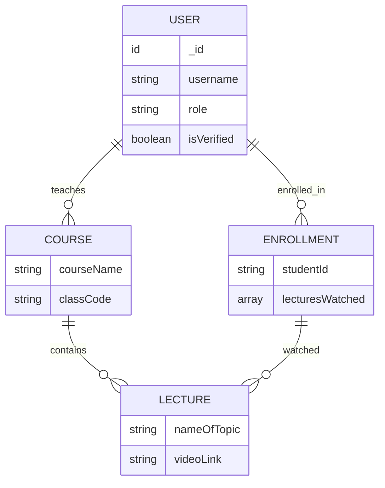

# 📊 Sarthi Learning Platform – Technical Presentation

---

## 🔹 Slide 1: Introduction to Sarthi

* **Title:** Sarthi – Modern E-Learning with Adaptive Video Delivery
* **Overview:**
  A virtual classroom platform that enables teachers to upload, manage, and stream educational videos efficiently.
* **Problem Solved:**
  Seamless lecture delivery using scalable video processing and structured course management.

---

## 🏗️ Slide 2: System Architecture (High-Level)



* **Architecture Style:** Modular monolith with RESTful API boundaries
* **Design Consideration:** Media processing isolated from request-response logic for performance

---

## 💻 Slide 3: Technology Stack



* **Notable Tools:** FFmpeg (video encoding), HLS.js (frontend streaming), JWT (auth), Mongoose (ORM)

---

## 🔐 Slide 4: Secure Auth & Role Access

* **Auth Flow:**
  Registration → Email Verification → JWT Token → Auth Middleware
* **Roles:**

  * `student`: Consume content
  * `teacher`: Upload/manage courses
* **JWT Middleware:**

  ```js
  const token = req.headers['authorization']?.split(' ')[1];
  const decoded = jwt.verify(token, process.env.JWT_SECRET);
  req.user = decoded;
  ```

---

## 📚 Slide 5: Course & Lecture Management

* **Teachers:** Create structured courses
* **Students:** Join via invite code
* **Lecture Units:** Each includes video, comments, analytics
* **Schema Highlights:**

  * `Course` ↔ `Lecture` (1\:N)
  * `User` ↔ `Enrollment` (N\:M)

---

## 🎞️ Slide 6: Video Processing Pipeline (Core Backend Logic)



* **Multi-resolution Output:**

  * 240p / 360p / 720p segments generated
* **FFmpeg Sample:**

  ```bash
  ffmpeg -i input.mp4 -profile:v baseline -level 3.0 -start_number 0 \
         -hls_time 10 -hls_list_size 0 -f hls output.m3u8
  ```

---

## 📺 Slide 7: Adaptive Video Streaming (Frontend-Backend Integration)

* **Client-Side:**

  ```js
  if (Hls.isSupported()) {
    const hls = new Hls();
    hls.loadSource(videoLink);
    hls.attachMedia(videoRef.current);
  }
  ```

* **Backend Streaming Endpoint:**

  * `GET /video/:id/stream/index.m3u8`
  * Uses `express.static()` to serve segment files

* **Streaming Benefits:**

  * Seamless playback on weak networks
  * Client automatically switches resolutions

---

## 🧠 Slide 8: Database Schema Design



* **Backend Challenges:**

  * Populate references with Mongoose
  * Performance optimization using indexing

---

## 🐳 Slide 9: CI/CD & Dockerization

* **Docker Container:** FFmpeg + Node.js backend bundled
* **CI/CD via GitHub Actions:**

  ```yaml
  - name: Build & Push
    uses: docker/build-push-action@v5
    with:
      context: ./Backend
      tags: ${{ secrets.DOCKERHUB_USERNAME }}/sarthi-backend:latest
  ```
* **DevOps Notes:**

  * Can extend to multi-container setup using Docker Compose
  * Add S3 or CDN for HLS scalability

---

## ✨ Slide 10: Key Features & UX Enhancements

* ✅ Comments under lectures
* ✅ QR Code for course joining
* ✅ Lecture Likes & Views
* ✅ Personal note-taking per lecture
* ✅ Admin dashboard (optional extension)

---

## 🔍 Slide 11: Swagger API Docs & Testing

* **Swagger Integration:**

  ```js
  const swaggerOptions = {
    definition: { openapi: '3.0.0', info: { title: 'Sarthi API' } },
    apis: ['./routes/*.js'],
  };
  ```
* **Benefits:**

  * Interactive API explorer
  * Validates payload formats
  * Fast developer onboarding

---
